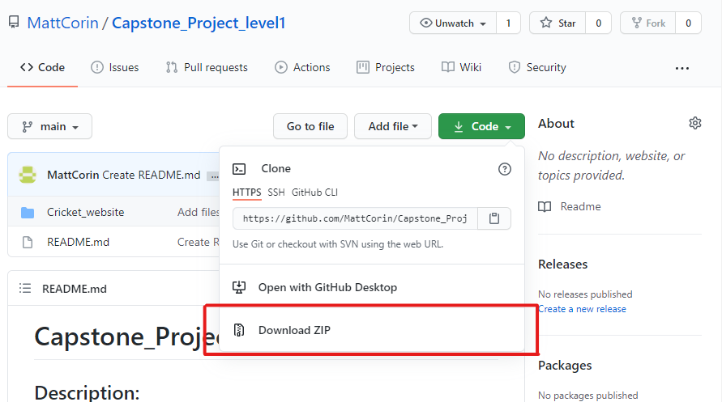
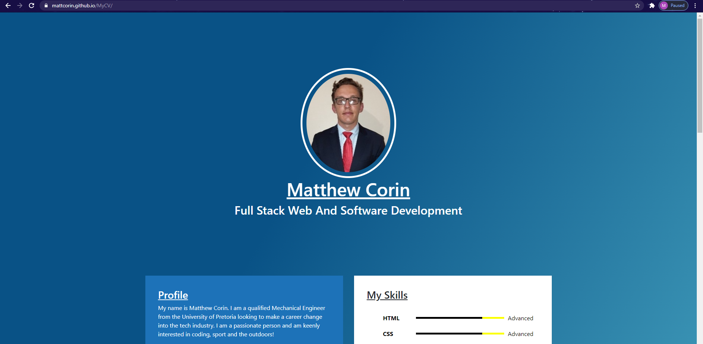

# MyCV

## Description:
A comprehensive personal CV/resume for Matthew Corin created using HTML and CSS.

## Table of Content
1. Installation
2. Usage

## 1. Installation
The files can be downloaded from my personal GitHub repository at https://github.com/MattCorin/Capstone_Project_level1. 
Under the green "Code" dropdown, the files can be downloaded by clicking Download Zip as indicated in the image below:
  

 
Once these files are downloaded, they must then be extracted to a folder of your choice on your computer by right-clicking on the downloaded zip folder and clicking "Extract All...". 
  
Once extracted, the website can be used on your local machine! Simply navigate to the folder to which you extracted the files and double-click on the "index.html" file to open the home page.

 

## 2. Usage
The website can be found at https://mattcorin.github.io/MyCV. This will navigate you to the home page, which looks like the following:
  

 
This page contains all the required career info for Matthew Corin. 

## 3. Credits
Credit must be given to my HyperionDev mentor, Dayle Klinkhamer (Forgemaster132), who assisted throughout the course of this website creation.  

